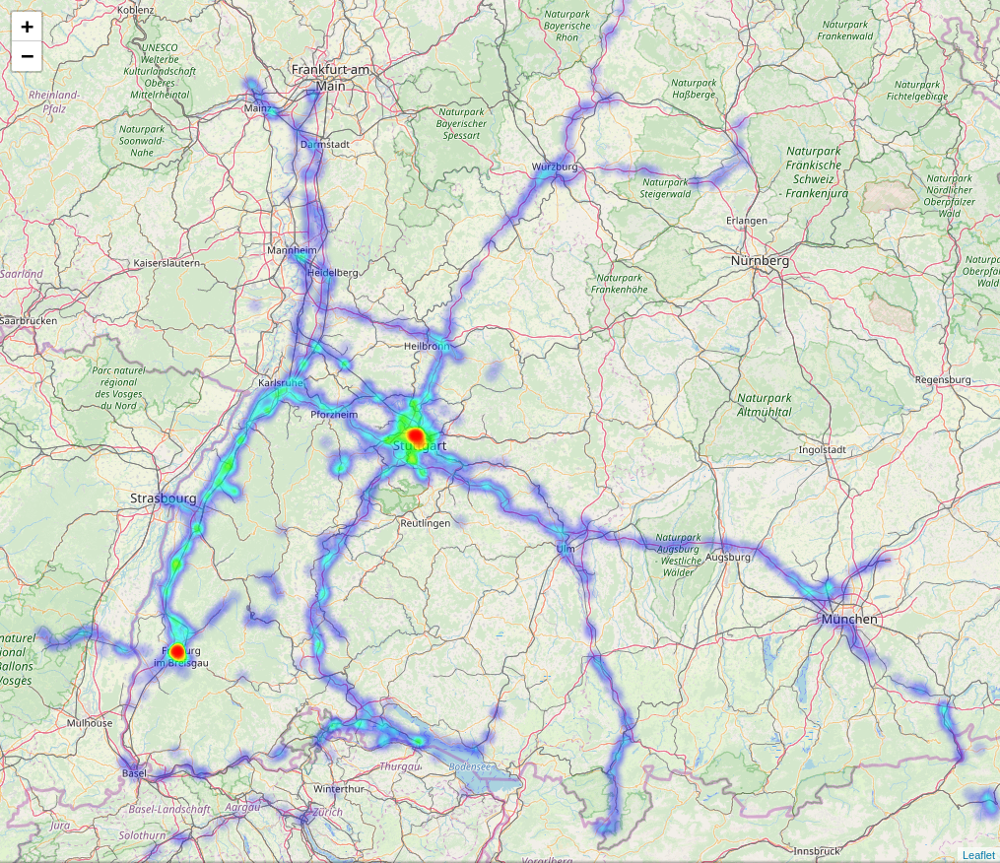

# geo-heatmap

A script that generates an interactive geo heatmap from your location data provided by google using folium and OpenStreetMap.

<center></center>

## How to get your location data

Here you can find out how to download your google data: <https://support.google.com/accounts/answer/3024190?hl=en></br>
Here you can download your google data: <https://takeout.google.com/>

For this script you just have to download your location history, which is provided by google as JSON file.

## Getting Started

### Prepare your data

Rename the JSON file to `locations.json` and paste it in the project folder.

### Run the script
```
python geo_heatmap.py
```
The script will generate a CSV file named `heatmap.csv` and a HTML file named `heatmap.html`. Open the `heatmap.html` file to see your heatmap.
